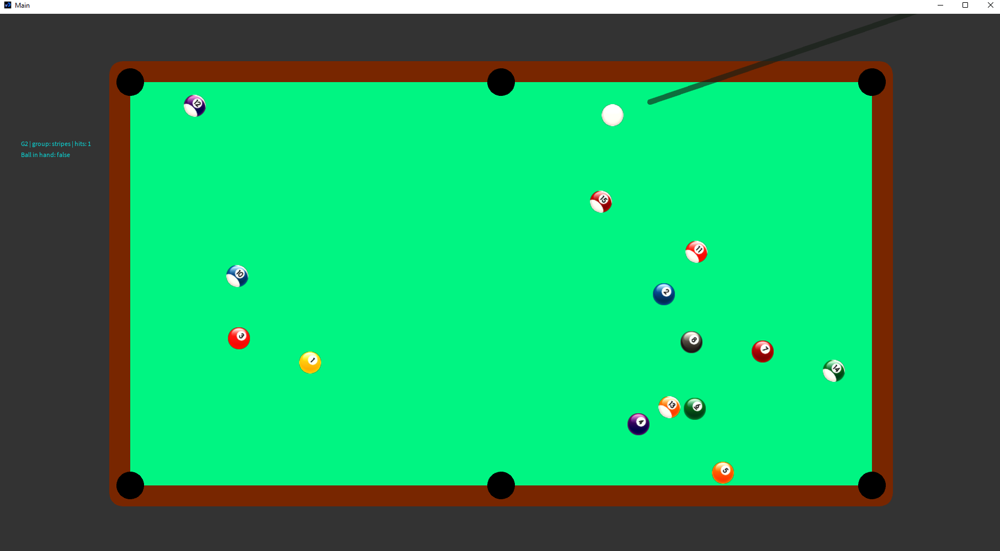

# 8-ball-processing

Implementation of 8 ball pool game in Processing

Project was created by
* Mikołaj Macura [@mikomac405](https://github.com/mikomac405) - Graphics / interface and game logic
* Łukasz Piątkowski [@LukaszPiatkowski27](https://github.com/LukaszPiatkowski27) - Physics simulation and game logic

-------------

It was implemented for the purposes of computer science studies at the Silesian University of Technology - 2022
